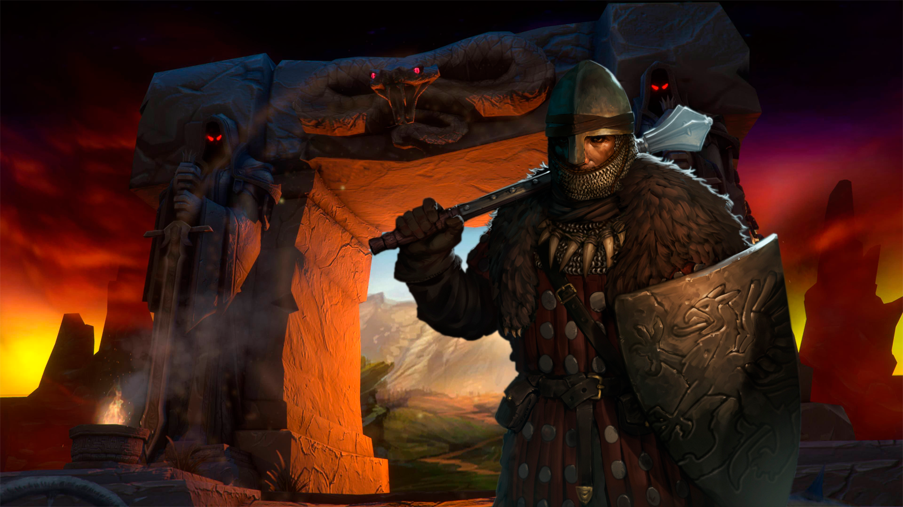
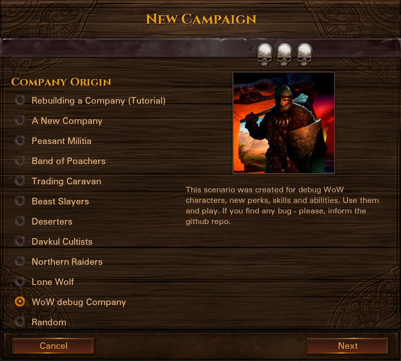

# Brothers-WoW

## Mode Game Processing
Classes that should be implemented for the addon - alliance classes from World of Warcraft Classic:
*  [paladin](https://github.com/datchannin/Brothers-WoW/blob/master/spec/paladin.md)
*  [warrior](https://github.com/datchannin/Brothers-WoW/blob/master/spec/warrior.md)
*  [hunter](https://github.com/datchannin/Brothers-WoW/blob/master/spec/hunter.md)
*  druid
*  [rogue](https://github.com/datchannin/Brothers-WoW/blob/master/spec/rogue.md)
*  warlock
*  [mage](https://github.com/datchannin/Brothers-WoW/blob/master/spec/mage.md)
*  [priest](https://github.com/datchannin/Brothers-WoW/blob/master/spec/priest.md)

## Workflow
* 
*  [release link](https://github.com/datchannin/Brothers-WoW/releases)
*  [perk calculator](https://bbwow.net)

## Description
New character from every class can be hired in the different random cities and villages, the same way as characters with original backgrounds. Player can combine original characters and new wow characters and use all of them in the battle. All characters should be leveled to the highest possible level.

WoW characters have separate talent tree. Talents (or perks) are implemented from different WoW specialization, for example Protection Spec Warrior talents and Arms Spec Warrior talents are be used in the same Perk Tree of Warrior. Player can select perks as he wants.

After certain conditions will be executed, Raid Dungeons should be added into the world. Raid or dungeon bosses from the World of Warcraft game will be met by player. If player want come in into dungeon, he should use only new characters of this modification. After all npc in dungeon will be killed, new raid places will appear in the world.

For the future the plan is to add WoW-like equipment in addition to standard weapons and equipment of this modification. Also such  equipment should be used by certain character classes and additional bonuses should be added to the user with full sets of equipments, as this is done by using raid sets of World of Warcraft.

## Requirements
* Battle Brothers with all DLC installed, version 1.4.0.40
* mod_wow.zip, the latest version

## Usage
To install this mode you should do step-by-step:
1. Download and install the latest "Battle Brothers" game.
2. Download the latest directory from "Brothers-WoW" release repo: [release link](https://github.com/datchannin/Brothers-WoW/releases)
3. Put addon into the "data" dir (you should put zip without unzipping).
4. Run the game. "bbWoW" addon works by default.
5. For test or debug this addon, select "WoW debug Company" from the scenario list.

## License, Authors and Copyright

This repository is used for private mode Battle Brothers game. Play Battle Brothers the same way as WoW.

This file is part of the Brothers-WoW Project. 

AUTHORS: Datchannin.

COPYRIGHT: Reprint or usage of materials/scripts/unique names from this repository is permitted only with the consent of the owner.

World of Warcraft content and materials are trademarks and copyrights of Blizzard or its licensors. All rights reserved. Brothers-WoW project is not affiliated with Blizzard or its licensors.

Battle Brothers content and materials are trademarks and copyrights of Overhype Studios or its licensors. All rights reserved. Brothers-WoW project is not affiliated with Overhype Studios or its licensors.
